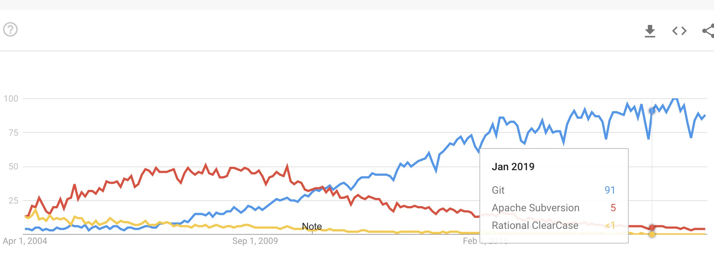
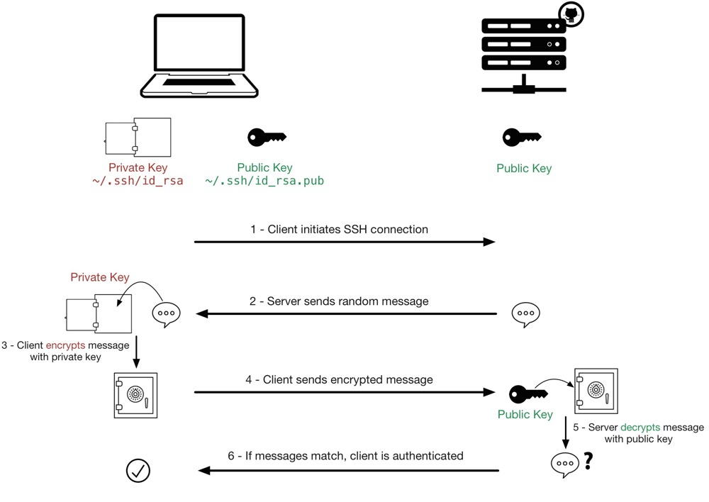

# Version Control System, Git & GitHub

## Why do we need Version Control System?
1. How do you collaborate? work as a team?
2. How to trace / track / restore / merge changes and versions?
3. How to govern / secure / manage the source code / documents?

## Why Git & GitHub?

* Git is the most popular and wide-used version control system (VCS) today. It was created by Linus Torvalds (The father of Linux).

* GitHub is an internet hosting service for git repositories. Public repos are free; private repos are paid. As a shared space for repos, it allows you to do collaborative work.

* Git is the VCS used to use GitHub, GitLab, AliyunCode etc.
* Now Github is part of your credentials - a measure of your coding abilities and skills.

### Aliyun Code Control System:
https://code.aliyun.com/

## VCS history - Git vs SVN vs Clearcase
https://trends.google.com/trends/explore?date=2004-03-19%202020-04-19&geo=US&q=%2Fm%2F05vqwg,%2Fm%2F012ct9,%2Fm%2F01ybz2



## Create a GitHub Account 

1. got to https://github.com/ click sign up
2. enter username, email, password. 
3. Click `create account`. An verification email is sent.
4. verify email address via the link sent in email.

## Create a Git Repository 

1. got to https://github.com/ click `new`, or go to https://github.com/new 
2. enter repos name, e.g. `myproject`
3. choose public vs private (for class projects, choose private)

## Collaborate a project with others

For a group project, the project owner needs to add collaborators (group members) in the project:
1. Settings -> Manage access -> Click on `Invite a collaborator` 
2. enter collaborator's email or user name. An email invite is sent to the collaborator
3. the collaborator needs to click on link in the email to accept the invite. 
4. repeat above steps for all collaborators
Now all collaborators cannot contribute to the projects.

## Github Code Deliveries 

Github supports multiple protocols for connecting to a repository.

1. HTTPS: https://github.com/mkz100/JavaClass.git (use basic auth - username / password)
2. SSH (Secure Shell) : git@github.com:mkz100/JavaClass.git (use private / public keys) 
3. CLI : Github command line interface
4. Github Desktop: a separate utility to manage code deliveries.

SSH is recommended for most use cases. It is secure and simple for cli as well as IDEs.

## [Optional] Set up SSH 
SSH or Secure Shell is a network communication protocol that enables two computers to communicate and share data thru Public key infrastructure (PKI).

### Understand the basics of PKI
Public-Private key encryption:


https://docs.github.com/en/github/authenticating-to-github/connecting-to-github-with-ssh

### Benefits for using SSH

Using the SSH protocol, you can connect and authenticate to remote servers and services. With SSH keys, you can connect to GitHub without supplying your username and personal access token at `each visit`.

### Generate SSH key pair

https://docs.github.com/en/github/authenticating-to-github/generating-a-new-ssh-key-and-adding-it-to-the-ssh-agent

```
ssh-keygen -t ed25519 -C "kai.zhang@gmail.com"

Generating public/private ed25519 key pair.
Enter file in which to save the key (/Users/kai/.ssh/id_ed25519):
Enter passphrase (empty for no passphrase):
Enter same passphrase again:
Your identification has been saved in /Users/kai/.ssh/id_ed25519.
Your public key has been saved in /Users/kai/.ssh/id_ed25519.pub.
The key fingerprint is:
SHA256:jUd3OvKAYMvpIOH4jJ6n3/AaJSRTtem59hkl6EfTrN4 kai.zhang@gmail.com
The key's randomart image is:
+--[ED25519 256]--+
|   ...           |
|  .   o          |
| o.. oo   . . .  |
| o+..oo+o= . o   |
|. o..=++S+= o    |
| + .+oo =. + .   |
|. oo +.+    .    |
|. ..* + +        |
| ++o.o + E       |
+----[SHA256]-----+

cd ~/.ssh

ls -tl
-rw-r--r-- 1 kai staff  101 Apr 21 11:00 id_ed25519.pub
-rw------- 1 kai staff  411 Apr 21 11:00 id_ed25519

cat id_ed25519.pub

ssh-ed25519 AAAAC3NzaC1lZDI1NTE5AAAAILqKbXREGEGhueLFY5WCsKWjCiWHx7rjy7uOhV1XTYR0 kai.zhang@gmail.com

```
The private (id_ed25519) and public (id_ed25519.pub) key pair is created.

### Adding a new SSH key to your GitHub account

https://docs.github.com/en/github/authenticating-to-github/adding-a-new-ssh-key-to-your-github-account

### References

银行密码系统安全吗？质数（素数）到底有啥用？李永乐老师11分钟讲RSA加密算法（2018最新）
https://www.bilibili.com/video/BV1Ts411H7u9?from=search&seid=15843569033862803906

什么是公钥私钥加密验证原理
https://www.bilibili.com/video/BV11t41117Fm?from=search&seid=15161199292547360730

区块链的基石：非对称加密技术简介
https://www.bilibili.com/video/BV1eW411e7xS/?spm_id_from=333.788.recommend_more_video.6

Git + GitHub 10分钟完全入门
https://www.bilibili.com/video/BV1KD4y1S7FL/?spm_id_from=333.788.recommend_more_video.2

### Common Problems

* Failed to push -
```
error: failed to push some refs to 'https://github.com/mkz100/JavaClass.git'
hint: Updates were rejected because the tip of your current branch is behind
hint: its remote counterpart. Integrate the remote changes (e.g.
hint: 'git pull ...') before pushing again.
```

* Failed to authenticate - 
  * SSH -- check the private / public key pair setup
  * HTTPS -- check the configuration