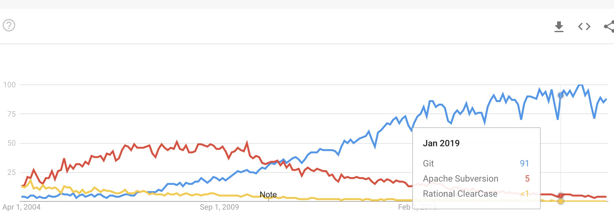

# Version Control System, Git & GitHub

## Why do we need Version Control System?
1. How do you collaborate? work as a team?
2. How to trace / track / restore / merge changes and versions?
3. How to govern / secure / manage the source code / documents?

## Why Git & GitHub?

* Git is the most popular and wide-used version control system (VCS) today. It was created by Linus Torvalds (The father of Linux).

* GitHub is an internet hosting service for git repositories. Public repos are free; private repos are paid. As a shared space for repos, it allows you to do collaborative work.

* Git is the VCS used to use GitHub, GitLab, AliyunCode etc.
* Now Github is part of your credentials - a measure of your coding abilities and skills.

## VCS history - Git vs SVN vs Clearcase
https://trends.google.com/trends/explore?date=2004-03-19%202020-04-19&geo=US&q=%2Fm%2F05vqwg,%2Fm%2F012ct9,%2Fm%2F01ybz2

## 