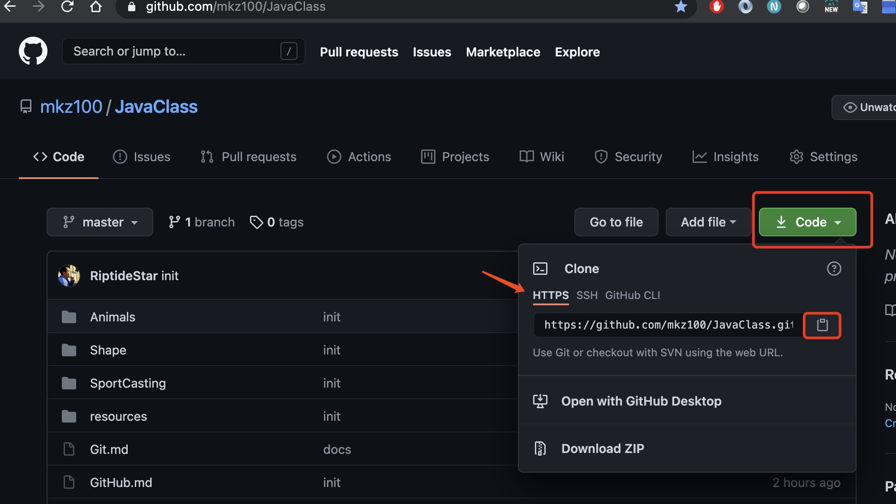
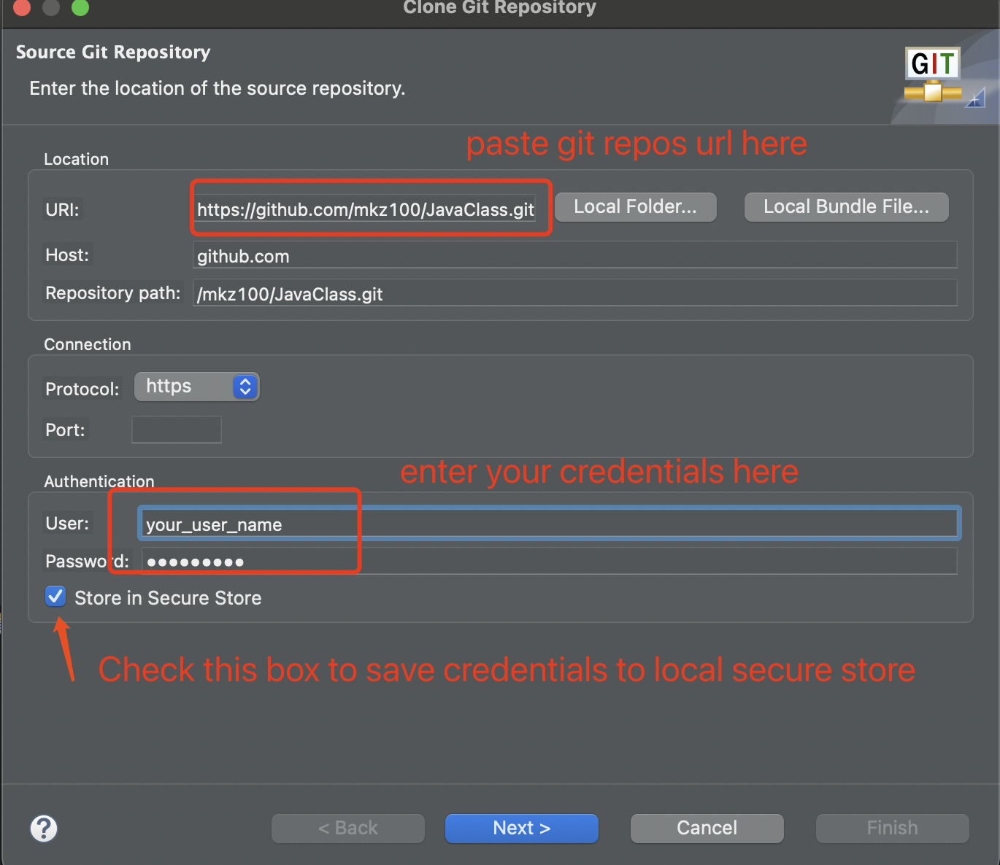
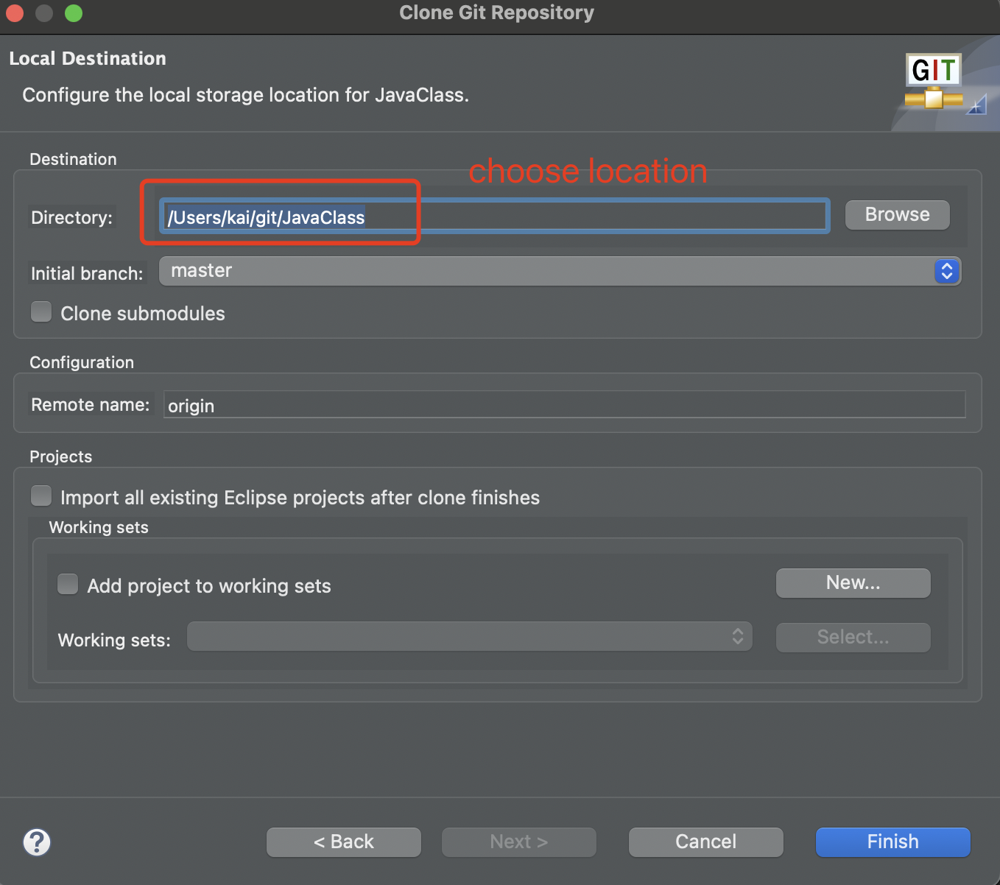
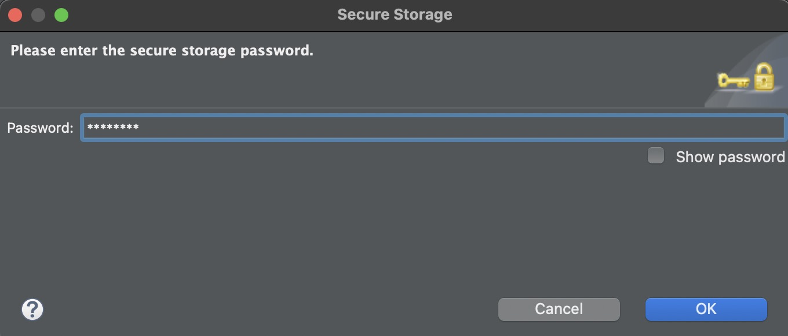
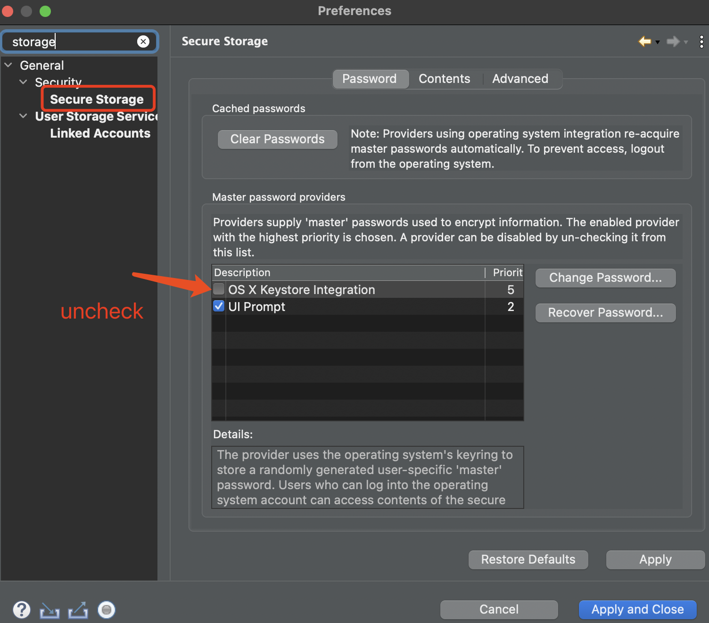

# Set up GitHub in Eclipse

1. Open Eclipse (My version comes with Github client built-in)
2. Open Git perspective \
   
3. clone the Git repository - click `"Clone a Git repository"` \
   
4. Copy git repos url from Github \
   ß
5. Enter URL and credentials in Eclipse Git clone window \
   \
   Next -> Next -> \
   \
   Enter the local secure store password \
   
6. Note: Please check the `"Store in Secure Store"` to save your credentials to the local secure store to avoid entering credentials every time pushing date to Github. If encounters this error `"Failed to write credentials for 'your git repo URL' to secure store No password provided."`, please go `Preferences->General->Security->Secure Storage` uncheck the highlighted item: \
   
7. Now the Github repository is cloned and you are ready to deliver your code to Github.

