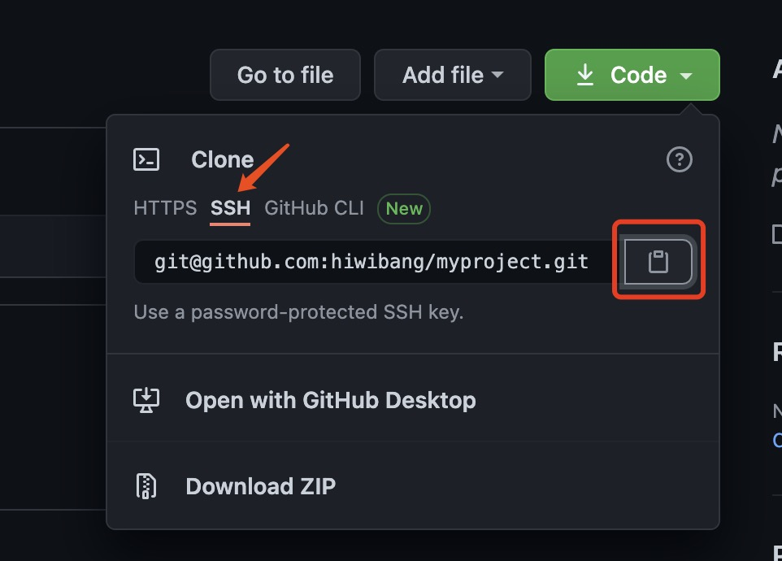
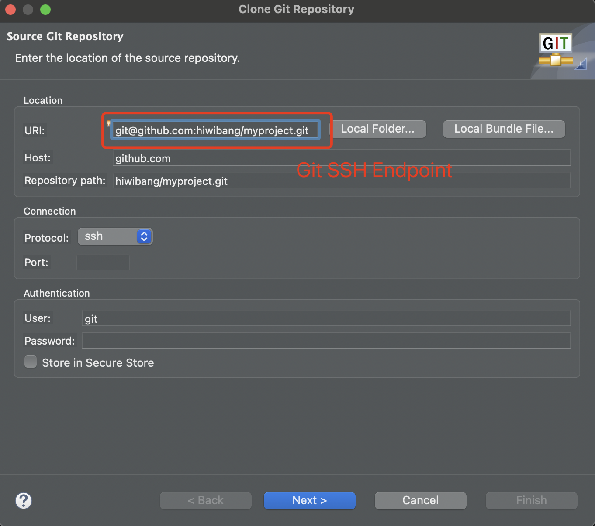

# Set up GitHub in Eclipse

1. Open Eclipse (My version comes with Github client built-in)
2. Open Git perspective \
   
3. clone the Git repository - click `"Clone a Git repository"` \
   
   
## Option1 - Using HTTPS protocol 
1. Copy git repos url from Github \
   
2. Paste URL and credentials in Eclipse Git clone window \
   \
3. Next -> Next -> Finish \
   \
   Enter the local secure store password \
   

Note: Make sure check the `"Store in Secure Store"` to save your credentials to the local secure store to avoid entering credentials every time pushing date to Github. If encounters this error `"Failed to write credentials for 'your git repo URL' to secure store No password provided."`, please go `Preferences->General->Security->Secure Storage` uncheck the highlighted item: \
   

## Option2 - Using SSH protocol (Recommended)
This option is simpler and more secure.

1. Generate SSH key pair - Revisit [GitHub.md](GitHub.md)
2. Adding a new SSH key to your GitHub account - Revisit [GitHub.md](GitHub.md)
3. Copy git ssh endpoint from Github \
   
4. Paste ssh endpoint in Eclipse Git clone window \
   
5. Next -> Finish

### Now the Github repository is cloned and you are ready to deliver your code to Github.