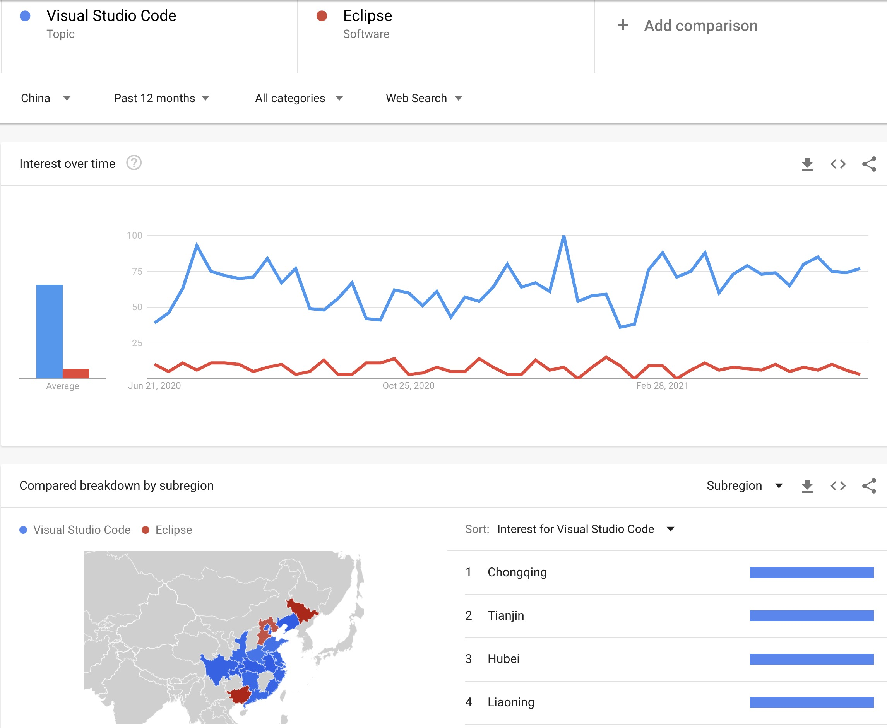

# VS Code (Visual Studio Code)

It is the best universal editor / IDE for almost every language and scripting you might need in computing.

https://code.visualstudio.com/

# References

VSCode 入门教程 https://geek-docs.com/vscode/vscode-tutorials/introduction-to-vscode.html

VS Code 入门 https://www.bilibili.com/video/BV1LA411h7Yc/

VSCode 新手快速入门指南 https://www.bilibili.com/video/BV1Ct411M7or/

 

